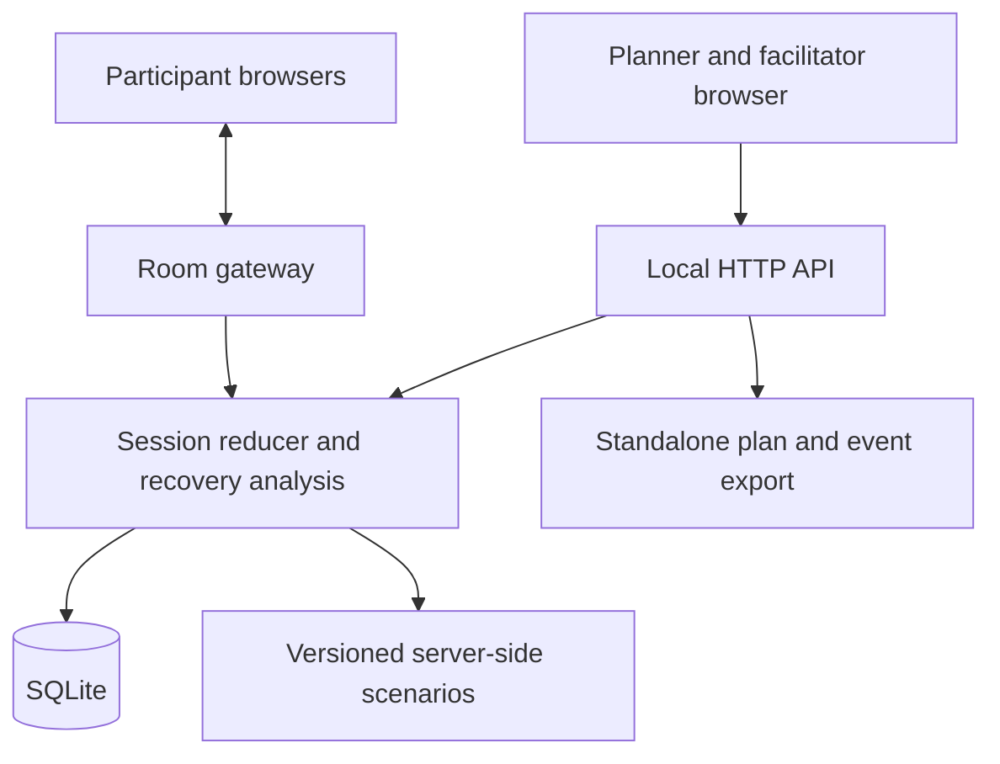

# BLACKOUT PROTOCOL — AI implementation brief

Status: ready for implementation planning; application implementation has not started.

## 0. How a coding agent should use this document

Build BLACKOUT PROTOCOL as a working hackathon prototype. Follow the milestones in order, finish the required scope, and verify each milestone before expanding it. Use the acceptance criteria as the definition of completion.

This specification leaves routine implementation choices to the coding agent. Read applicable repository instructions, inspect existing files, and preserve unrelated work. If a working implementation already exists, continue it and reconcile this specification with its architecture. Use the proposed stack below when starting from an empty repository.

Record meaningful deviations and their reasons in `docs/DECISIONS.md`. Keep a concise milestone checklist in `docs/PROGRESS.md`, including actual validation results and remaining limitations. Mark work complete only when it works and has been checked. Describe simulated behavior clearly in the product and submission materials.

Use synthetic organisation data for the demo. The application models account recovery and runs exercises; its actions affect the simulation. It stores recovery-method descriptions and ownership, without collecting passwords, recovery codes, authentication cookies, or provider credentials.

The schedule is milestone-based so this brief can be handed to an AI agent without assumptions about human team size or working hours.

## 1. Product objective

### One-sentence pitch

**BLACKOUT PROTOCOL lets a small organisation experience losing its main account, discover why its recovery plan fails, and test an improved plan before a real incident.**

### Primary user

The person informally responsible for technology in a small charity, student organisation, or business. They understand their team's tools but may have little incident-response experience.

### Core question

“If this account or device disappeared, could we still recover access and continue our essential work?”

### Required product loop

1. Describe a small organisation and its recovery arrangements.
2. See how accounts, people, devices, and business activities depend on each other.
3. Simulate a specific failure.
4. Explain blocked recovery routes with concrete prerequisites.
5. Run a cooperative incident exercise with different information for each participant.
6. Add an independent recovery route to a copy of the model.
7. Re-run the same failure and compare the model's results.
8. Export an offline action plan with owners and assumptions.

The central demonstration is: **lose access → discover the loop → model a fallback → demonstrate the difference**.

### What makes the combination useful

Recovery analysis gives the exercise a technical foundation. The exercise reveals coordination problems that a diagram alone would miss. The action plan connects both to work the organisation can carry out afterwards.

Cyber exercises are established practice; the NCSC's [Exercise in a Box](https://www.ncsc.gov.uk/section/exercise-in-a-box/overview) already supports rehearsing cyber incidents. Position this project's contribution around explainable recovery dependencies, different participant perspectives, and a measured comparison after changing the model. Avoid claiming the invention of cyber exercises or recovery planning.

## 2. Strategy for the judging criteria

The supplied Defence brief assigns 30% to innovation; 20% each to category relevance, usability, and design; and 10% to completeness and implementation.

| Criterion | What the prototype should demonstrate |
| --- | --- |
| Innovation | A playable incident directly driven by explicit recovery dependencies, including circular recovery and multiple prerequisites. |
| Category relevance | Clear support for preparedness, response, and continuity when an account becomes unavailable or compromised. |
| Usability | A useful first result from a supplied template in under three minutes during a usability trial. Record the actual result. |
| Design | A readable map, focused participant screens, clear reasons for blocked actions, and an understandable comparison. |
| Implementation | A complete saved session, deterministic analysis, functioning multiplayer roles, offline export, and repeatable demo. |

Each screen should support a decision or show evidence. The project earns its credibility through working behavior and precise explanations. Treat all timing and performance numbers in this brief as validation targets until measured.

## 3. Scope and release priorities

### Required scope — P0

1. One fictional organisation template and a form for editing its resources and recovery rules.
2. A map with accounts, recovery resources, people, services, and business activities.
3. A deterministic rule engine supporting alternative recovery methods and methods requiring several prerequisites.
4. Distinct representations of access, trust, and potential recovery.
5. A failure selector for the primary work account, recovery mailbox, and administrator phone; the complete narrative exercise covers the work-account incident.
6. Explanations for blocked routes, circular dependencies, and a missing independent starting point.
7. One complete branching exercise with administrator, finance, and coordinator roles.
8. Both a solo facilitator walkthrough and a room that three participants can join.
9. Participant-specific information, shared observations, and a facilitator control screen.
10. A saved action timeline and a debrief derived from actual events.
11. A proposed-improvement model, analysis against the same failure, and an explicit comparison.
12. A standalone HTML recovery plan that can be opened without the running application, plus printable styling.
13. Local persistence, room resumption, and reliable state refresh after reconnecting.
14. A seeded demo, one-click reset, and a short presentation route.

### Add after P0 is stable — P1

- A second complete narrative scenario involving a missing phone.
- Simulation of shared failure groups such as several recovery methods on one device.
- Comparing the effect of each individual resource failure.
- A second organisation template.
- Polish translation and a language switch; keep strings centralised in P0.
- More graph editing controls and automatic layout.
- Optional explanatory text generated from already computed findings.
- A reusable scenario-authoring schema and validation tool.
- Cryptographically signed exports, with their verification assumptions documented.

### Later product development — P2

- Provider-specific setup guidance maintained against current provider documentation.
- Read-only account inventory integrations with explicit permissions.
- Multiple organisations, persistent user accounts, and production access control.
- Scheduled reminders to retest recovery methods and refresh emergency plans.
- Additional exercises, analytics across sessions, and facilitator content tools.
- Independent security review and usability trials with real organisations.

### Scope boundary

P0 changes fictional accounts inside its own simulation. Provider recovery, password resets, sending messages to actual colleagues, and incident-response automation remain manual real-world activities. Automatic discovery of every account is outside P0. Uploaded evidence files, arbitrary PDF ingestion, and live desktop monitoring are also outside this release.

## 4. Reference organisation and coherent incident

### Organisation: Harbor Aid

Harbor Aid is a fictional volunteer organisation preparing a community distribution event. Its team needs access to a volunteer roster, shared instructions, and reliable communication. All services and recovery policies in this fixture are fictional and explicitly labelled as such.

### Initial resources

| Resource | Initial condition | Role in the model |
| --- | --- | --- |
| Work identity | Accessible and trusted before the incident | Provides sign-in to shared files, roster, and team chat. |
| Recovery mailbox | Currently inaccessible because its credentials are unavailable | Can recover the work identity; its own documented reset route uses the work identity. |
| Shared files | Available through a work session | Contains the current emergency instructions. |
| Volunteer roster | Available through a work session | Needed to organise shifts. |
| Team chat | Available through a work session | Used for routine coordination. |
| Public website | Public page remains readable | Demonstrates that related services do not automatically all fail. |
| Administrator phone | Available | Carries one contact method and one fictional authentication capability. |
| Coordinator | Available | Knows an independently stored contact and can act as recovery custodian. |
| Clean recovery device | Available in the fixture | A prerequisite for the selected recovery procedure. |
| Offline recovery kit | Absent in baseline | Proposed independent recovery route in the improved model. |

The recovery mailbox's initial inaccessibility is explicit. A cycle is not a dead end when an accessible trusted entry point still exists.

### Failure semantics

The incident explicitly removes the team's control of the work identity and revokes the relevant simulated work sessions. Files, roster, and chat then lose their available access routes. The public website stays readable. The graph must explain which event or dependency caused every change.

An account marked compromised is not automatically treated as inaccessible. This particular scenario includes a lockout. Other failure snapshots can represent access that still exists but is unsafe to trust.

### The memorable finding

“Your work account can be recovered through your backup mailbox. Your backup mailbox can only be recovered through your work account. The emergency instructions are also behind the work account.”

### Proposed improvement

Model an independently stored recovery kit, an available custodian, and the clean device required by this fictional provider's recovery rule. Retrieving the kit grants a possible path to regaining control. Separate containment and verification actions are required before the work identity is treated as trusted again.

Adding this route in the planner changes the simulated configuration. The product must say that implementing and testing the corresponding real-world setup remains an assigned action.

## 5. User journeys

### A. First-time planner

1. Open the landing screen and choose “Try Harbor Aid”.
2. Read a short summary of the organisation's essential activities.
3. Inspect the map and select the work identity.
4. Choose “Simulate losing control”.
5. Open “Why recovery is blocked”.
6. See the circular dependency and the unavailable emergency instructions.
7. Choose “Model an independent recovery kit”.
8. Review the proposed rule and its prerequisites.
9. Compare baseline and improved recoverability.
10. Export the plan with tasks and assumptions.

This journey must work before multiplayer is added.

### B. Cooperative exercise

1. A facilitator creates a room from a frozen blueprint and selects the scenario.
2. Participants join using the local room link; the facilitator assigns roles.
3. Each participant sees a short role briefing and only their authorised information.
4. The facilitator starts the exercise.
5. Participants receive different observations and can publish selected observations to the shared board.
6. They choose actions, provide confirmations, and observe the effects.
7. The team reaches a stable outcome or the facilitator ends the exercise.
8. The debrief links outcomes to decisions and dependencies.
9. The team creates an improved blueprint and compares the same failure.

### C. Offline reference

1. Export a self-contained HTML recovery plan.
2. Close the application and disconnect from the network.
3. Open the export and read contacts, ownership, steps, and caveats.
4. Print the plan if required.

The export contains no live room credentials or actual recovery secrets.

## 6. Screens and interface behavior

| Screen | Required content | Primary action |
| --- | --- | --- |
| Start | Pitch, sample organisation, resume saved work | Try the demo |
| Organisation setup | Resources, business activities, owners, recovery assumptions | Review map |
| Recovery map | Dependencies, selected node details, failure controls, legend | Simulate a failure |
| Finding details | Blocked rule, prerequisites, supporting assumptions, affected activities | Model improvement |
| Room lobby | Join link, participants, role assignment, connection state | Start exercise |
| Participant workspace | Role briefing, private observations, shared board, allowed actions | Investigate or act |
| Facilitator workspace | All observations, scenario controls, room state, pause/reset | Advance incident |
| Debrief | Timeline, blocked actions, decisions, unresolved questions | Improve the plan |
| Comparison | Baseline versus changed model, same failure, changed assumptions | Export action plan |

### Map layout

- Use separate visual groups for recovery resources, accounts, and business activities.
- Edges point from a prerequisite to the capability or action it enables.
- Represent a method with several prerequisites as an explicit method node or labelled group.
- Use text and icons along with colour for accessible, blocked, uncertain, and compromised states.
- Display current access separately from a forecast that a route could be completed.
- Clicking a blocked node opens a plain-language explanation and the exact relevant route.
- Provide a list view with the same findings for mobile users and keyboard navigation.
- Use stable positions in the sample blueprint; animation should preserve the user's orientation.

### Participant workspace

On mobile, prioritise the current observation, choices, and shared board. The full graph is secondary. Actions with unmet prerequisites remain visible with a reason. Show pending, accepted, and rejected states accurately; an action is accepted only after the server acknowledges its persisted result.

### Visual direction and Mr. Robot references

Use charcoal backgrounds, bright readable body text, restrained red incident accents, and a distinct cool colour for proposed recovery paths. Reserve monospace type for event identifiers and chapter labels. Use accessible labels and sufficient contrast throughout.

Subtle references can include a one-time “Hello, friend.” greeting and chapter identifiers such as `eps1.0_lockout`, `eps1.1_dead_end`, and `eps1.2_recovery`. Use original graphics and writing. Keep motion short, respect reduced-motion preferences, and keep sound off by default.

## 7. Recovery model — the technical core

### Three separate questions

1. **Access:** Can the team use this resource now?
2. **Trust:** Is it appropriate to rely on it for the intended action?
3. **Recoverability:** Can the team complete a documented sequence of steps from the current resources?

An available mailbox may be compromised. A blocked account may be recoverable. Recovering account control does not by itself establish that attacker access has been removed.

NIST distinguishes authentication, recovery, and authenticator lifecycle operations, and describes several recovery mechanisms. Its [account recovery guidance](https://pages.nist.gov/800-63-4/sp800-63b/events/) is useful background. Real provider policies vary; every user-entered recovery method must retain its source, review date, and stated confidence. A generic template must not imply that every provider supports the same method.

### Representation

Represent facts as named capabilities, for example:

```text
work.control
work.trusted
backup.trusted
device.clean
custodian.available
offline-kit.available
work.credentials-rotated
work.sessions-revoked
work.recovery-settings-reviewed
files.available
roster.available
chat.available
volunteers.coordination-available
```

Represent a recovery or operational rule with:

```ts
type RecoveryRule = {
  id: string;
  label: string;
  kind: 'derived' | 'action';
  requiresAll: string[];
  grants: string[];
  enabled: boolean;
  responsibleRole?: 'administrator' | 'finance' | 'coordinator';
  evidence: 'fixture' | 'user-marked-tested' | 'user-reported' | 'unknown';
  sourceNote: string;
  lastReviewedAt?: string;
};
```

Multiple rules granting the same capability express alternatives: method A **or** method B. Several entries in `requiresAll` express a conjunction: device **and** code location **and** custodian. A plain graph edge must never silently replace an AND requirement with an OR.

Use positive prerequisites in the P0 forecast. Actual scenario events can add or remove facts; after each accepted event, recompute the forecast from the new snapshot. Keep any action with destructive, consuming, or mutually exclusive effects outside the simple forecast closure unless its effects are explicitly supported. The P0 recovery actions should be monotonic within a forecast: they add recovery capabilities without consuming shared resources.

### Current state versus forecast

- Current capabilities come from recorded state plus applicable `derived` rules.
- A forecast may explore both `derived` and supported `action` rules.
- Forecasting does not mutate session state or execute actions.
- Actual actions are validated and applied by the session reducer when a participant submits them.
- Record an explanation for each newly reachable capability: rule, prerequisites, and evidence.

### Deterministic reachability algorithm

```text
1. Apply the selected failure's explicit effects to a copy of the blueprint snapshot.
2. Seed known available capabilities from that snapshot.
3. Select enabled rules allowed by the chosen evidence policy.
4. Repeatedly find a rule whose complete prerequisite set is available.
5. Add its granted capabilities and record a witness explanation.
6. Stop when a complete pass adds nothing.
7. Explain unreached targets using their candidate rules and missing prerequisites.
```

Use stable rule ordering to make explanations repeatable. Explain one feasible route first; additional routes can be shown as alternatives. Do not label the first discovered route “optimal” or “fastest”.

### Evidence and incomplete information

Compute results for the documented model, tagging every route with its weakest supporting assumption. Separately identify routes supported only by fixture facts or methods the user has marked tested. Those labels describe the input evidence; a user's “tested” flag is still a user assertion.

Exclude unknown rules from a claim that a route works. Show “Needs confirmation” with the specific unknown prerequisites. If no documented route is found, say “No recovery route found in this model”. Keep missing facts visible instead of silently treating missing information as evidence of safety or permanent failure.

### Cycle detection

Use strongly connected components to find candidate dependency cycles in the prerequisite graph. A cycle is a finding only when the full rule analysis shows the selected targets cannot be reached from the available resources. An independent alternative can break the dead end even though the visual cycle still exists.

### Example recovery sequence

1. Offline kit + custodian + clean device permit the fictional work-account recovery action.
2. That action grants `work.control`.
3. Separate actions rotate credentials, revoke sessions, and review recovery settings.
4. The fixture's containment rule requires those completed steps and grants `work.trusted`.
5. Trusted work access enables the relevant service sign-ins.
6. Roster access plus an available communication route enables volunteer coordination.

These are simulation rules. Provider-specific real procedures require their own verified instructions.

### Improvement suggestions

P0 should use a small, inspectable set of templates: independent recovery method, offline instructions, additional custodian, and alternate communication contact. Apply each candidate to a blueprint copy and recompute the failure. Explain which targets gain a route and which assumptions were added. Never silently add a recovery capability to a real configuration.

## 8. Scenario: `eps1.0_lockout`

### Roles

- **Administrator:** sees account and service symptoms; can perform technical recovery actions.
- **Finance:** sees the suspicious payment request and can pause or escalate it.
- **Coordinator:** sees operational impact, knows an independent contact, and can coordinate the fallback.
- **Facilitator:** controls the exercise and sees its complete state.
- **Observer:** sees only the public projection during play.

### Scenario stages

| Stage | Private or shared information | Available decisions | Recorded consequence |
| --- | --- | --- | --- |
| 0. Briefing | Roles and normal operating context | Confirm ready | Start snapshot recorded |
| 1. Lockout | Administrator receives a work-account lockout notice | Investigate, share observation, attempt documented recovery | Failure effects applied; recovery loop exposed when inspected |
| 2. Conflicting request | Finance receives an urgent request apparently from the administrator | Pause, ask for independent verification, approve in simulation | Verification or unsafe approval recorded |
| 3. Operational pressure | Coordinator cannot open the roster; public website still works | Share impact, use known contact, seek instructions | Team discovers the instructions share the failed dependency |
| 4. Recovery attempt | Team chooses available methods | Attempt backup route, inspect prerequisites, escalate to external support | Impossible actions explain blockers; provider-support outcome remains pending/unknown |
| 5. Debrief | All authorised exercise information becomes reviewable | Inspect timeline and propose changes | Baseline findings and follow-up tasks created |
| 6. Improved run | Same failure applied to a new blueprint version | Retrieve fictional offline kit and complete recovery/containment | New feasible route and actual action sequence recorded |

### Branch rules

- Actions depend on current prerequisites and role permissions.
- Independent verification requires a known contact outside the suspect channel. The coordinator's observation supplies that information in the fixture.
- Approving the suspicious request produces a simulated loss event, with the amount clearly part of the fictional scenario.
- Waiting for provider support remains an unresolved external dependency with an unknown completion time.
- Finding no recovery route is a valid baseline outcome; the debrief still produces useful actions.
- Avoid hidden arbitrary penalties. Explain the relationship between a decision and its consequence.

### Pacing

Provide facilitator advance/pause controls and a normal exercise mode designed for a short session. The presentation mode uses the same engine and compressed pacing. Store any scenario variation with a stable seed. Prefer event-driven transitions for P0; record scheduled timestamps if timed events are added, so refreshing a browser cannot restart or duplicate them.

## 9. Session state, persistence, and multiplayer

### Session lifecycle

```text
draft → lobby → running ↔ paused → completed → debrief
```

Reset creates a new run referencing the same immutable blueprint and scenario versions. An improved run references a new blueprint version. Preserve the original run for comparison.

### Authority and persistence

The server owns room state. Each action includes a unique action ID and the session revision the participant observed. Validate room membership, role, current phase, and action prerequisites. Reject stale or invalid actions with a fresh projection and useful explanation.

For accepted actions, persist the event and resulting revision in one transaction before acknowledging and broadcasting. A duplicate action ID returns its previous result. Allocate monotonically increasing per-session sequence numbers for ordering; record server timestamps for display.

### Reconnection

Reconnect to a fresh role-filtered snapshot and the current revision. The interface must show when it is disconnected and must not claim an unsent action succeeded. Query an uncertain action ID after reconnecting before offering a retry. Keep pending action IDs across a refresh if implementing automatic retry.

[Socket.IO documents](https://socket.io/docs/v4/delivery-guarantees/) ordering guarantees and default at-most-once delivery; application persistence and reconciliation remain necessary. Implement explicit snapshots and idempotent actions rather than assuming transport reconnection reconstructs the session.

### Role separation

- Resolve actor identity from the server session, never from a submitted role field.
- Give the facilitator a distinct session capability.
- Require facilitator assignment or approval for participant roles.
- Send each participant only their permitted observations and actions.
- Keep scenario secrets and unrevealed branches on the server; omit them from client bundles and initial payloads.
- The public observer view never includes private finance or coordinator clues before they are shared.
- Solo mode explicitly presents the facilitator's complete view.

### Local operation

Run one server on the demo laptop with the database on that laptop. Other devices connect over the same reachable LAN. Bundle all fonts, images, scripts, and scenario data locally. Internet loss must not affect that local room while the server, power, and LAN remain available.

This release does not provide communication between disconnected Wi-Fi areas. If the server becomes unavailable, participant controls show a disconnected state; the separately downloaded runbook remains readable.

Test the actual venue or travel-router arrangement early, including client isolation and firewall settings. Keep a single-laptop demonstration route available.

## 10. Proposed architecture and repository layout

### Stack

| Layer | Proposed choice | Reason |
| --- | --- | --- |
| Language | TypeScript | Shared domain types across client, server, and analysis. |
| Web client | React with Vite | A small browser application and straightforward local assets. |
| Dependency visualisation | React Flow, package `@xyflow/react` | Custom nodes, edges, and interactive selection. |
| Styling | CSS variables and a small component system | Consistent styling with limited setup. |
| HTTP server | Node.js with Fastify | Local API and room endpoints. |
| Room transport | Socket.IO | Room updates; application manages persistence and reconciliation. |
| Database | SQLite | One durable local database for the prototype. |
| Validation | Shared runtime schemas, for example Zod | Validate blueprint imports, scenario definitions, and commands. |
| Testing | Vitest and Playwright | Domain checks and critical browser journeys. |
| Export | Self-contained HTML and JSON | Readable offline plan plus structured session data. |

Check compatible runtime and package versions when implementation starts; commit a lockfile. Keep SQLite persistence behind a small adapter. Choose a driver compatible with the selected Node runtime and use real SQLite transaction tests.

[React Flow's documentation](https://reactflow.dev/learn) describes the graph components and package; [Vite](https://vite.dev/guide/) and [Fastify](https://fastify.dev/docs/latest/) document their current setup requirements. These choices are proposed defaults; an existing working stack takes precedence when it meets the behavior specified here.



### Suggested tree

```text
apps/
  web/src/
    routes/
    components/
    features/blueprint/
    features/recovery-map/
    features/session/
    features/debrief/
    features/comparison/
    styles/
  server/src/
    api/
    rooms/
    persistence/
    projections/
    exports/
    scenarios/
packages/
  domain/src/
    model/
    validation/
    reachability/
    explanations/
    scenario-reducer/
    comparison/
fixtures/
  harbor-aid/
tests/
  integration/
  e2e/
docs/
  DECISIONS.md
  PROGRESS.md
  DEMO.md
  VALIDATION.md
  SOURCES.md
  SUBMISSION.md
```

Avoid complicated build orchestration for its own sake. A simpler single repository with these logical boundaries is acceptable. The domain package must remain independent of React, the database, and any language model API.

## 11. Data contracts

| Entity | Required fields |
| --- | --- |
| Organisation blueprint | ID, version, name, resources, rules, initial facts, critical targets, owners, assumptions. |
| Resource | ID, kind, label, owner reference, described recovery methods, evidence label, optional failure-group ID, display position. |
| Business activity | ID, label, required capability, criticality selected by the user. |
| Failure definition | ID, affected resources, explicit fact removals/additions, disabled rules, reason labels. |
| Scenario | ID, version, roles, initial failure, stages, observations, action definitions, transition conditions. |
| Session | ID, frozen blueprint, scenario version, seed, phase, revision, current facts, current stage, start/end times. |
| Participant | ID, session ID, assigned role, server-issued membership credential, connection status. |
| Observation | ID, session ID, audience, revealed-at sequence, content, source label, confirmation state. |
| Event | ID, session ID, sequence, action ID when applicable, actor, type, timestamp, validated payload. |
| Finding | ID, target, blocked or feasible route, supporting rule IDs, missing prerequisites, assumption labels. |
| Improvement | ID, source finding, proposed blueprint changes, owner, implementation status, review date. |
| Comparison | Baseline version, improved version, failure ID, scenario version, engine version, result sets and assumptions. |

Database tables can store validated blueprint snapshots as JSON and indexed session/events/participants as normal records. Enforce uniqueness for `(sessionId, actionId)` and `(sessionId, sequence)`.

### Suggested API responsibilities

```text
GET    /api/templates
POST   /api/blueprints
GET    /api/blueprints/:id
POST   /api/blueprints/:id/versions
POST   /api/analysis
POST   /api/comparisons
POST   /api/sessions
POST   /api/sessions/:id/join
GET    /api/sessions/:id/state
POST   /api/sessions/:id/commands
GET    /api/sessions/:id/actions/:actionId
GET    /api/sessions/:id/export
POST   /api/blueprints/:id/export-plan
```

All session reads return a projection authorised for the caller. Apply input-size limits, validate IDs and imported content, and escape user-provided text in HTML exports. Demo reset must require facilitator authority and affect only the selected synthetic session.

## 12. Debrief, metrics, and exports

### Debrief questions

- What actually happened in this exercise?
- Which business activities lost a usable path?
- Which recovery attempts were blocked, and by what prerequisite?
- Which observation changed the team's decision?
- Did the team rely on a compromised communication channel?
- Which tasks should have an owner after the exercise?

### Required measurements

1. Critical targets reachable under the selected failure, with the denominator visible.
2. Critical targets with a route relying on untested user-reported assumptions.
3. Targets whose status needs more information.
4. First valid containment action time in this exercise, or “not completed”.
5. Time to a documented recovery route in the exercise, or “no route found”.
6. Unsafe simulated decisions and the concrete rules explaining them.
7. Improvements proposed, assigned, and marked implemented/tested by the user.

Use explicit counts and labels. An arbitrary overall security score is outside P0.

### Comparing plans fairly

Freeze the failure definition, target set, scenario version, and engine version. Compare immutable baseline and improved blueprint versions. List every added assumption. Calculate results from the engine; never hardcode a reassuring result card.

Distinguish modelled recoverability from elapsed exercise time. A quicker second playthrough can reflect learning. It is not evidence that a real incident would be resolved that much faster. Real provider waiting times remain unknown unless documented.

### Offline plan content

- Organisation and blueprint version.
- Failure scenario covered and date of review.
- Essential activities and their owners.
- Known recovery routes and prerequisites.
- Where an authorised person can find recovery materials, without embedding secrets.
- Alternate contacts explicitly selected for inclusion.
- Containment and recovery tasks linked to source notes.
- Unresolved assumptions and provider-dependent steps.
- Space for the next review date and practice outcome.

Escape all imported content. Include all styling locally. Provide print CSS and meaningful page breaks. Verify the downloaded HTML independently after shutting down the app. CISA's [incident-response planning guidance](https://www.cisa.gov/sites/default/files/2024-02/Incident-Response-Plan-Basics_508c_1Feb2024.pdf) supports preparing response roles and keeping usable copies of plans and contacts.

### Exercise record integrity

Export a JSON timeline with its schema and engine versions. Display its SHA-256 digest separately so a saved digest can detect later file changes. This establishes consistency against that digest; it does not prove external events happened, provide an independent trusted timestamp, or prevent someone replacing both the file and digest. The MVP's transcript is an exercise record.

## 13. AI use inside the product

The required product works without a model API. Rules determine reachability, state changes, permissions, and outcomes.

An optional later feature may draft explanations or alternative scenario wording from structured findings. Every generated explanation must refer to existing findings, avoid inventing provider capabilities, and fall back to templates when unavailable. Preserve original inputs and let users review the text. Do not send a real organisation's dependency inventory to an external model by default.

AI-assisted development and external resources should be recorded accurately for the submission, as required by the supplied brief.

## 14. Implementation milestones

### M0 — Repository and contracts

**Build:** inspect the repository, choose compatible dependencies, establish client/server/domain boundaries, add schemas, create the Harbor Aid fixture, and document key decisions.

**Done when:** the client and server start locally; the fixture validates; the repository has repeatable development, type-check, test, and build commands. Document any dependencies on an external service.

### M1 — Recovery engine

**Build:** pure reachability analysis, AND/OR rules, evidence labels, failure application, current-versus-forecast distinction, explanation witnesses, and cycle findings.

**Done when:** domain tests cover the cases in section 15. The baseline fixture cannot recover the work account through the circular route. Adding the modelled independent kit produces a valid explained sequence without mutating the baseline.

### M2 — Planner and first complete product loop

**Build:** template loading, resource/rule forms, graph and list views, failure selection, finding details, candidate improvement application, and comparison.

**Done when:** a user can complete journey A without opening developer tools. Every displayed count matches the engine. Refreshing preserves the saved blueprint.

### M3 — Solo scenario and event record

**Build:** scenario schema, deterministic reducer, stages, decisions, role briefings, event persistence, facilitator controls, and debrief.

**Done when:** a complete exercise runs on one laptop. An invalid recovery attempt explains its blocker. Both the safe-verification branch and unsafe-payment branch are reproducible. Restarting the server can resume the saved session.

### M4 — Cooperative room

**Build:** lobby, membership and role assignment, filtered projections, shared observations, accepted-action acknowledgements, idempotency, and reconnection.

**Done when:** three participant browser contexts and one facilitator can complete the scenario. Private observations do not appear in other roles' API responses or payloads. A duplicate command produces one accepted event. Reconnecting restores the correct projection.

### M5 — Improvements, exports, and integrity check

**Build:** immutable improved blueprint versions, a second run against the same failure, comparison explanations, offline HTML export, JSON event export, and digest verification.

**Done when:** the original run remains intact, comparison results are reproducible, the offline plan opens with the server stopped, and changing one byte in the exported transcript fails verification against its saved digest.

### M6 — Design and demo reliability

**Build:** coherent styling, mobile participant screens, keyboard/list alternatives, reduced-motion behavior, empty/error/disconnected states, stable graph transitions, and demo reset.

**Done when:** every P0 journey is usable at laptop and phone widths, the presentation route can be reset and repeated, and the app runs with its WAN connection removed while the local server and LAN remain available.

### M7 — Validation and submission package

**Build:** execute the validation matrix, document results and limitations, prepare the demo script, record a fallback walkthrough, and write a maximum-ten-slide presentation outline.

**Done when:** P0 acceptance criteria are met or clearly documented as unmet; the project description matches the implemented behavior; submission materials disclose relevant AI, libraries, and pre-existing work.

### Scope reduction order if time becomes constrained

First remove P1 work, AI narration, extra animations, and flexible graph layout. Then limit blueprint editing to structured forms around the supplied template. Protect the recovery engine, the baseline/improved comparison, one complete scenario, and the offline export. If multiplayer cannot be finished, deliver and accurately describe the solo facilitator version; mark multiplayer incomplete.

## 15. Validation matrix

### Domain correctness

- A two-account cycle with no available entry point is blocked.
- The same cycle with one usable trusted entry point has a feasible route.
- Two alternative methods work when one method is blocked.
- A method needing two prerequisites fails when either is missing.
- Compromised access is excluded from actions requiring trusted access.
- Restoring control alone does not automatically mark an account trusted.
- An unknown method produces an uncertainty finding and is excluded from confirmed route counts.
- Failure effects disable exactly the declared facts/rules; unrelated public services remain available.
- Recovery forecasting does not execute an action or mutate the session.
- Evidence labels propagate through multi-step routes.
- A proposed improvement leaves the baseline unchanged.
- Fixed blueprint, failure, scenario, and engine versions produce stable results.

### Server and room behavior

- Role spoofing, unauthorised facilitator actions, and cross-room access are rejected.
- Private observations are absent from unauthorised projections and the client bundle.
- Concurrent valid actions receive distinct ordered events; stale conflicting actions are rejected clearly.
- Retrying an accepted action ID cannot repeat its consequence.
- A crash after transaction commit and before acknowledgement can be reconciled by action ID.
- Refresh and reconnect recover the same authorised current state.
- Pause/resume does not duplicate scenario events.

### Browser acceptance journeys

1. Load template → apply failure → inspect loop → propose kit → compare.
2. Join three roles → share relevant observations → verify suspicious request → debrief.
3. Choose the unsafe simulated request → observe consequence → inspect its explanation.
4. Complete the improved recovery route, including containment gates.
5. Export plan → stop server → open file offline → print preview.
6. Run with WAN disabled and LAN retained → reconnect a participant.
7. Use the list view and keyboard controls to inspect findings.

### Performance and usability targets

- Planning target: analysis for a 30-resource, 100-rule blueprint completes within 500 ms on the demo laptop.
- Planning target: accepted room actions reach connected participant views within one second on the tested LAN under normal conditions.
- Exercise capacity target: one facilitator, three players, and one observer. Describe larger capacity only after measuring it.
- Ask at least two people unfamiliar with the project to explain the recovery loop and the proposed improvement after using the interface.
- Record device, browser, graph size, client count, and actual results in `docs/VALIDATION.md`.

## 16. Demonstration and presentation

### Three-minute demo script

| Time | Action | Point to communicate |
| --- | --- | --- |
| 0:00–0:20 | Show Harbor Aid and its normal map | One account supports important daily work. |
| 0:20–0:45 | Trigger the work-account incident | Distinguish services that lose access from those still available. |
| 0:45–1:15 | Try the documented recovery route | The recovery mailbox depends on the account it must recover. |
| 1:15–1:40 | Show different role observations and independent verification | The team must combine information to make a sound decision. |
| 1:40–2:20 | Open the prepared improved blueprint and apply the same failure | An independent recovery resource changes the computed route. |
| 2:20–2:45 | Show containment steps and comparison | Recoverability and trusted operation are separate, measurable outcomes. |
| 2:45–3:00 | Open the downloaded offline plan | The team leaves with concrete owners and next actions. |

Prepared checkpoints must represent real saved states produced by the engine. A judge should be able to inspect their inputs. During a short presentation, switching to a prepared improved blueprint is acceptable when explained; use the normal editor during a longer demonstration.

### Presentation outline — maximum ten slides

1. Title, team name, members, and the central question.
2. Target user and a concrete lockout problem.
3. Product loop: map, exercise, improve, export.
4. Recovery graph and circular-dependency finding.
5. Cooperative roles and incomplete information.
6. Working demo or concise screenshots of it.
7. Comparison with computed results and stated assumptions.
8. Architecture and the technical work completed during the event.
9. Validation, limitations, and practical next steps.
10. Closing value statement, repository/demo links, and resource/AI disclosure.

Keep detailed acknowledgements in the repository and include a readable disclosure in the submission materials. The supplied brief permits Polish or English and requires a project title, team name, team members, project description, and a PDF presentation of at most ten slides. Repository and demo links are optional supporting materials.

### Likely judge questions

- **What is real?** The rule engine, saved sessions, role separation, comparisons, and exports are functional. Account incidents and recovery operations use explicitly fictional fixture services.
- **How do you know recovery works?** The engine proves reachability within the entered model and shows prerequisites. Real provider procedures need external validation and testing.
- **What happens without internet?** The local room continues while its server, power, and LAN are available; the exported plan opens independently.
- **Why would a team use this again?** Changes to staff, devices, and services can invalidate the model. A short repeat exercise tests those changes.
- **What is different from existing exercises?** The team's recovery dependencies drive the exercise and the comparison after an improvement.

## 17. Final completion checklist for the implementing agent

- [ ] P0 product loop works from a fresh start through exported plan.
- [ ] Domain edge cases pass and explanations match their witnesses.
- [ ] All graph and comparison numbers come from current computed results.
- [ ] Baseline and improved versions are preserved separately.
- [ ] Scenario choices have deterministic, explainable consequences.
- [ ] Three roles receive properly filtered information.
- [ ] Persistence, duplicate commands, and reconnection are validated.
- [ ] The product distinguishes access, trust, recoverability, and uncertainty.
- [ ] The demo uses clearly labelled fictional accounts and data.
- [ ] Offline operation claims match the tested server/LAN arrangement.
- [ ] Downloaded HTML works with the application stopped.
- [ ] Transcript integrity verification has been exercised and its limits documented.
- [ ] Phone layout, keyboard navigation, list view, and reduced motion are checked.
- [ ] Type checking, production build, and meaningful tests pass.
- [ ] Demo reset and the presentation route have been rehearsed.
- [ ] README explains installation, operation, sample data, and actual limitations.
- [ ] Submission contents, resource acknowledgements, and AI disclosure are prepared accurately.

## 18. Copyable implementation handoff

> Implement BLACKOUT PROTOCOL using `BLACKOUT_PROTOCOL_PLAN.md` as the product and technical specification. First inspect this repository and its applicable instructions. Preserve existing work, establish the P0 schemas and Harbor Aid fixture, and proceed through milestones M0–M7. Use deterministic recovery rules, distinguish current access from trust and forecast recoverability, and make baseline/improved comparisons reproducible. Deliver the planner, one complete scenario, three participant roles, saved event history, and an offline plan export. Keep simulated account operations clearly labelled. Maintain progress and decision notes, run the specified meaningful checks, and finish the required user journeys before adding P1 features. Follow the environment's permission and publishing requirements.
