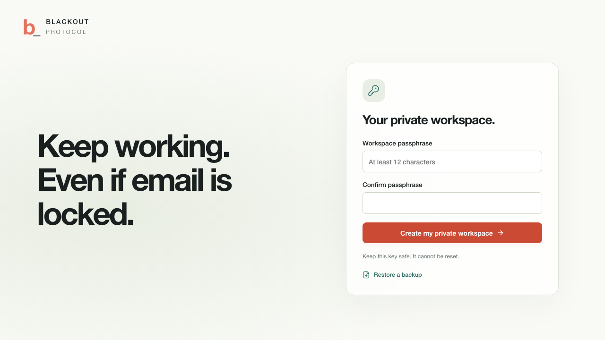

# BLACKOUT PROTOCOL — technical reference

The [README](../README.md) is the short introduction. This document preserves detailed setup, privacy, architecture and delivery notes.

**Find account-recovery dead ends before your organisation loses access.**

BLACKOUT PROTOCOL helps a small organisation record its actual accounts, recovery methods and essential work, then answer: **“If this email account or phone becomes unavailable, what can we still recover?”**

The default experience is a private organisation workspace. Analysis, encryption, provider-export import and readable-plan generation run on the device. An optional team check uses a reviewed copy of the same map. A separate fictional story is also available for practice.

**Finish and run this version:** [Handoff checklist](FINAL_HANDOFF.md).

**Understand the project:** [What changed and why](PROJECT_UPDATES.md) · [How to use it](USER_GUIDE.md).

## Interface



The dependency map is the main workspace. Select an account, then try a simulated loss to see the affected work and recovery options. [Map preview](screenshots/dependency-map.png) · [Blackout sandbox](screenshots/blackout-sandbox.png) · [Phone layout](screenshots/phone-plan.png) · [Team check](screenshots/own-team-running.png). These screenshots use example data from automated checks.

## What you can do

- Build your organisation’s dependency map one service at a time. Select a service to inspect its owner, dependencies and recovery methods.
- Record accounts, devices, recovery material, trusted people and their access dependencies.
- Choose **Try a blackout** and select one or several losses. Watch the same map show affected work and available recovery paths; inspect circular dependencies.
- Invite people into a check of your own map. Approve their access, assign accounts, record simulated recovery steps and download a shared summary.
- Evaluate independent recovery arrangements against the same failure and activities. Save a proposal separately from the current plan.
- Assign follow-up actions, record outcomes and keep the last 30 saved plan versions.
- Import `primaryEmail`, `recoveryEmail` and `recoveryPhone` from a Google Directory `users.list` JSON response. Other fields are discarded. Imported access is unavailable and methods are unconfirmed until reviewed.
- Save an encrypted workspace and encrypted backup; export a separate readable HTML recovery reference.

## Open without Node: portable workspace

The build produces **`dist/portable/BLACKOUT-PROTOCOL.html`**. Give this single file to an end user; they do not need Node or a running server. Open it in a modern browser, create a workspace passphrase, and enter the organisation's arrangements. The portable build embeds its scripts/styles and blocks network connections with a Content Security Policy. Team practice is omitted from its navigation.

**Verification status:** the self-contained file builds successfully, but opening it directly through `file://` has not yet been verified. The development browser blocks that protocol. Treat browser compatibility as an outstanding release check. Keep the file at the same location and use encrypted backups to transfer plans: browser storage for local files can vary by browser and file location.

The HTML is generated, not checked into the source repository. To produce it from source, use the developer commands below. No release asset has been published by this iteration.

## Run from source

Use Node.js **22.13+** (validated on **24.14.1**) and npm:

```sh
npm ci
npm run build
npm start
```

Open **http://localhost:4310**. The build also produces the portable HTML and a static web cache. After the web application reports **Available offline**, its cached planner can load without the server. Team exercise rooms still need their server. The service worker does not cache API responses or room traffic.

For development:

```sh
npm run dev
```

Open http://localhost:5173. Vite proxies exercise API traffic to port 4310. `npm start` serves built files and does not watch changes; rebuild frontend edits and restart after server edits.

| Variable | Default | Purpose |
| --- | --- | --- |
| `PORT` | `4310` | Web/exercise server port |
| `HOST` | `0.0.0.0` | Bind address; use `127.0.0.1` for this computer only |
| `BLACKOUT_DB` | `data/blackout.sqlite` | Shared rooms and fictional practice database |

## First useful result

1. Create an encrypted workspace with a separate passphrase of at least 12 characters. Keep it somewhere independent of the accounts you are modelling.
2. Select **Add first service**. Enter your team name, service name and responsible person, then save to the map. Add further services with **Add a service**.
3. Add accounts and resources. Mark only access you currently have. Record where recovery material is stored and what is needed to retrieve it.
4. Add each recovery method and all its prerequisites. Leave unsupported or uncertain procedures as **Needs confirmation**.
5. Define the activities that matter and their required accounts/resources. Save the plan.
6. Choose **Try a blackout**, then select a lost account, or use **More checks → Check with all accounts signed out**. Read the result and each route's prerequisites.
7. Save a useful improvement as a **proposed plan**, then implement and test the actual arrangement with its owner/provider.
8. Export a readable plan for authorised people and an encrypted backup for restoring this workspace.

Task status and method evidence are separate: completing a task does not silently mark a recovery procedure verified.

## Import Google recovery contacts

Choose **Import Google contacts** under the Google export option on the empty workspace, or use **Save & restore → Choose Directory JSON**. Supply a JSON response with a `users` array from the documented [Google Directory API](https://developers.google.com/workspace/admin/directory/reference/rest/v1/users). An authorised administrator obtains that export; this version does not request OAuth access or connect to Google.

The import accepts 1–50 users and up to 100 distinct accounts/resources. It resolves contacts that refer to another imported account and shares repeated external contacts. Review availability, evidence, dependencies, owners and useful activities before saving. A configured recovery contact alone does not prove access or recovery success.

## Privacy and recovery limits

The private planner's saved workspace and backups use **AES-256-GCM**, with a non-exportable in-memory key derived from the passphrase using **PBKDF2-SHA-256 with 600,000 iterations**, a random salt and a fresh encryption nonce. Planning stays local. **Check with team** sends a reviewed metadata snapshot only after you choose **Create team room**; private notes, instructions, tasks, history and the workspace key are excluded. Use HTTPS, localhost or a supported local-file browser context for Web Crypto.

- Lock the workspace on shared devices. Closing/reloading requires the passphrase again. There is no passphrase reset service.
- Export encrypted backups before clearing browser data. Older backups retain their original passphrase after a passphrase change.
- Readable HTML exports contain unencrypted organisation metadata. Share them only with authorised people.
- Enter names, aliases, locations and procedures; keep passwords, recovery codes and other secrets out of the plan.
- An unlocked page can read its plans. Encryption does not protect against a compromised device, malicious extension or modified application code. The implementation has not received an independent security review.
- Conflicting saves from another tab are rejected using an exclusive browser lock and a saved-snapshot check. Reload or lock/unlock to load the latest saved version; save a backup before discarding changes.

The model uses declared arrangements. A route is a conditional sequence of possible actions; BLACKOUT does not execute account recovery or verify provider policy. Unknown methods are excluded from working-route counts. After an actual compromise, gaining access and restoring trust require separate provider procedures.

## Team check of your own map

Choose **Check a problem → Check with team**. Preview the shared metadata and create a room. Owners become account assignments; joining participants wait for host approval before seeing the map. Approved members see the whole shared map, and account assignments limit the simulated actions they can record. The host can add account responsibilities, start/pause/finish the check, save a summary and delete the shared room. See the [user guide](USER_GUIDE.md#check-your-own-map-with-the-team).

A room is a snapshot. Actions update its simulated state; they never change provider accounts, private-plan evidence or actual permissions. Unknown methods and missing prerequisites block simulated recovery. Reports distinguish the original recovery forecast from the team's recorded actions.

Shared rooms use bearer credentials and plaintext SQLite on the local server. Use non-sensitive names/aliases and reviewed dependencies on a trusted network; keep this server off the public internet. The metadata can reveal how the organisation works. Room deletion removes active database records; downloaded copies and server backups may remain. The private planner stays encrypted separately. Physical LAN operation without internet and production security remain unverified.

## Separate team practice

Choose **Save & restore → Optional team practice → Open practice**, or open `/practice`. Harbor Aid is explicitly fictional. Its baseline failure leaves 1 of 4 essential activities reachable; an independent kit raises the forecast to 4 of 4 under the recorded prerequisites. Recovery and incident actions in this area are simulated.

The facilitator can practise alone or invite participants over a trusted LAN. Separate devices/browser profiles hold separate participant credentials. Roles have server-filtered clues, persisted commands and a shared incident timeline. See the [practice guide](DEMO.md).

Practice rooms use bearer credentials over local HTTP and plaintext SQLite/browser exercise storage. Use non-sensitive fictional data there. Do not expose this exercise server publicly. The encrypted private workspace uses a separate schema; sharing into an organisation room is explicit. The three-role browser journey is verified with independent browser profiles, including a custom role. Physical LAN operation with WAN disconnected remains unverified.

## Validation

```sh
npm run typecheck
npm run build
npm test
```

**41 unit/integration tests pass across 11 files.** Coverage includes arbitrary organisation plans, multiple losses, conditional recovery, import filtering, encrypted backup roundtrips/tampering, report escaping, account-scoped team actions, pending-member redaction, shared-field filtering, room deletion, exercise role filtering, persistence, idempotent commands and five Socket.IO clients. The realtime test requires permission to bind a temporary localhost listener.

**Nine Playwright browser journeys pass**: planning and map interaction, combined loss and proposed plans, HTML/encrypted downloads and file-picker restore, offline planner reload and report PDF rendering, contact import, stale-tab protection, independent team participants/custom roles, phone layout, setup keyboard focus, three-service direct editing, and the complete check of a shared organisation map. Direct-file compatibility, physical LAN use and unfamiliar-user comprehension remain open. See the [validation record](VALIDATION.md) and [user guide](USER_GUIDE.md).

## Structure and disclosure

- `packages/planner`: organisation schemas, analysis adapter, encrypted vault, Directory import and local HTML report.
- `apps/web/planner`: private workspace, guided setup, findings, actions and backups.
- `packages/domain`: shared closure/cycle engine and fictional exercise logic.
- `apps/server`: shared team-room and fictional-practice APIs, SQLite, Socket.IO and exports.
- `scripts/build-delivery.mjs`: portable HTML and static offline-cache generation.
- [Progress checkpoint](PROGRESS.md), [sources](SOURCES.md), [original submission draft](SUBMISSION.md).

Built with TypeScript, React, Vite, React Flow, Fastify, Socket.IO, Zod, Node SQLite, Lucide and noble hashes. AI assistance was used for design, implementation, testing and documentation. The application runs deterministic rules and does not require an AI service. Subtle Mr. Robot references remain in the fictional practice area; no show artwork or affiliation is used.
